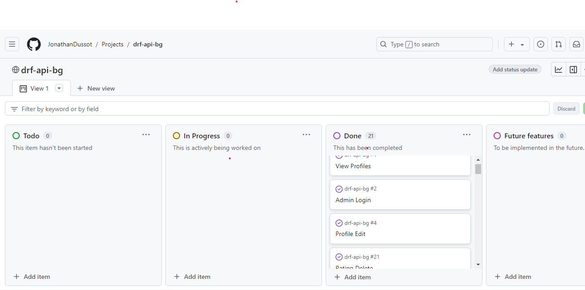

# DRF-API-BG

This is the backend for the *BoardGamers* app, built using Django Rest Framework. *BoardGamers* is a site that has been created solely with the purpose of sharing the passion of playing boardgames. The site allows users to create posts with some of their favourite games and others to give their personal reviews on the game, aswell as a like and/or rating of the game.

You can check the Github for *BoardGamers* by clicking [here](https://github.com/JonathanDussot/boardgamers).

### Live Deployment
- The live link for "BoardGamers" can be found [HERE](https://boardgamers-ci-364d7fb71032.herokuapp.com/)

## Table of Contents
+ [BoardGamers Github (Frontend)](# "BoardGamers")
+ [Live Deployment](#live-deployment "Live Deployment")
+ [User Stories](#user-stories "User Stories")
  + [Profile User stories](#profile "Profile User stories")
  + [Games User stories](#games "Games User stories")
  + [Reviews User stories](#reviews "Reviews User stories")
  + [Likes User stories](#likes "Likes User stories")
  + [Ratings User stories](#ratings "Ratings User stories")
+ [Models used and their datafields](#models-used-and-their-datafields "Models used and their datafields")
  + [Profile Model](#profile-model "Profile Model")
  + [Games Model](#games-model "Games Model")
  + [Reviews Model](#reviews-model "Reviews Model")
  + [Likes Model](#likes-model "Likes Model")
  + [Ratings Model](#ratings-model "Ratings Model")
+ [Features Left to Implement](#features-left-to-implement "Features Left to Implement")
+ [Testing](#testing "Testing")
  + [Validator Testing](#validator-testing "Validator Testing")
  + [CRUD Functionality Testing](#crud-functionality-testing "CRUD Functionality Testing")
  + [Bug Testing](#bug-testing "Bug Testing")
+ [Technologies Used](#technologies-used "Technologies Used")
  + [Main Languages Used](#main-languages-used "Main Languages Used")
  + [Frameworks, Libraries & Programs Used](#frameworks-libraries--programs-used "Frameworks, Libraries & Programs Used")
  + [Installed Packages](#installed-packages "Installed Packages")
+ [Deployment](#deployment "Deployment")
  + [Heroku](#heroku "Heroku")
  + [Local Deployment](#local-deployment "Local Deployment")
  + [Forking this GitHub repository](#forking-this-github-repository "Forking this GitHub repository")
  + [Clone this repository](#clone-this-repository "Clone this repository")
  + [Cloudinary](#cloudinary "Cloudinary")
  + [PostgreSQL](#create-postgresql-using-code-institute-database-maker "PostgreSQL")
+ [Credits](#credits "Credits")
  + [Code and Images](#code-and-images "Code and Images")
  + [Acknowledgements](#acknowledgements "Acknowledgements")

## User Stories
- Here is a list of all my user stories which can be found in my backend [project](https://github.com/users/JonathanDussot/projects/5) which employs the Agile methodology approach in an organized manner, each with their labels as per MoSCoW prioritization of tasks. 

### Profile

- [x] As a site/admin I can view a list of all created profiles. (Sprint 1)
- [x] As a site admin I can login and logout so that I can create, edit or delete data. (Sprint 1)
- [x] As a site admin I can enter a profile so that I can see all profile details. (Sprint 1)
- [x] As a site admin I can edit and update personal information. (Sprint 2)
- [x] As a site admin I can Delete a profile from the API. (Sprint 2)

### Games

- [x] As a site admin I can view a list of games created. (Sprint 1)
- [x] As a site admin I can create a game with all requested details. (Sprint 1)
- [x] As a site admin I can open a created game on the list so that I can see all of its details. (Sprint 2)
- [x] As a site admin I can edit all game details. (Sprint 2)
- [x] As a site admin I can Delete a game and its information stored in the API. (Sprint 2)

### Reviews

- [x] As a site admin I can view a list of all reviews posted by users. (Sprint 2)
- [x] As a site admin I can view a single review posted. (Sprint 2)
- [x] As a site admin I can create a review for a game post. (Sprint 2)
- [x] As a site admin I can edit the review information. (Sprint 3)
- [x] As a site admin I can Delete a Review from the API. (Sprint 3)

### Likes

- [x] As a site admin I can add a like for a games post. (Sprint 1)
- [x] As a site admin I can edit and change a like saved in the API. (Sprint 1)
- [x] As a site admin I can remove a like from the API. (Sprint 1)

### Ratings

- [x] As a site admin I can create a rating for a game post. (Sprint 3)
- [x] As a site admin I can edit a rating given. (Sprint 3)
- [x] As a site admin I can delete a rating from the API. (Sprint 3)

## Models used and their datafields

### Profile Model

owner = models.OneToOneField(User, on_delete=models.CASCADE) 
created_at = models.DateTimeField(auto_now_add=True) 
updated_at = models.DateTimeField(auto_now=True) 
name = models.CharField(max_length=255, blank=True) 
favourite_game = models.CharField(max_length=255, blank=True) 
image = models.ImageField(upload_to='images/', default='../default_profile_yqtpvj')

### Games Model

owner = models.ForeignKey(User, on_delete=models.CASCADE) 
title = models.CharField(max_length=255) 
description = models.TextField() 
designer = models.CharField(max_length=255, blank=True, null=True) 
artist = models.CharField(max_length=255, blank=True, null=True) 
publisher = models.CharField(max_length=255, blank=True, null=True) 
min_players = models.IntegerField(validators=[MinValueValidator(1), MaxValueValidator(10)]) 
max_players = models.IntegerField(validators=[MinValueValidator(1), MaxValueValidator(10)]) 
solo_play = models.BooleanField(default=False) 
image = models.ImageField(upload_to='images/', default='../default_post_ynmksg', blank=True) 
genre_filter = models.CharField(max_length=32, choices=genre_filter_choices, default='none') 
created_at = models.DateTimeField(auto_now_add=True) 
updated_at = models.DateTimeField(auto_now=True)

### Reviews Model

owner = models.ForeignKey(User, on_delete=models.CASCADE) 
game = models.ForeignKey(Game, on_delete=models.CASCADE) 
created_at = models.DateTimeField(auto_now_add=True) 
updated_at = models.DateTimeField(auto_now=True) 
content = models.TextField()

### Likes Model

owner = models.ForeignKey(User, on_delete=models.CASCADE) 
game = models.ForeignKey(Game, related_name='likes', on_delete=models.CASCADE) 
created_at = models.DateTimeField(auto_now_add=True)

### Ratings Model

rating = models.IntegerField(validators=[MinValueValidator(1), MaxValueValidator(6)],default=3,) 
game = models.ForeignKey(Game, on_delete=models.CASCADE, related_name='ratings') 
owner = models.ForeignKey(User, on_delete=models.CASCADE) 
created_at = models.DateTimeField(auto_now_add=True)

## Features Left to Implement
- This can be found within the *BoardGamers* [README.md file](https://github.com/JonathanDussot/boardgamers/blob/main/README.md)

## Testing

### Validator Testing
| **TEST** | **ACTION** | **EXPECTATION** | **RESULT** |
| ----------------------------- | ----------------------- | --------------------------- | ---------- |
| drf_api_bg - settings.py | PEP8 validator | [No issues found](images/pep8validation.png) | ✅ |
| drf_api_bg - urls.py | PEP8 validator | No issues found | ✅ |
| games app - forms.py | PEP8 validator | No issues found | ✅ |
| games app - models.py | PEP8 validator | No issues found | ✅ |
| games app - views.py | PEP8 validator | No issues found | ✅ |
| games app - urls.py | PEP8 validator | No issues found | ✅ |
| games app - admin.py | PEP8 validator | No issues found | ✅ |
| likes app - forms.py | PEP8 validator | No issues found | ✅ |
| likes app - models.py | PEP8 validator | No issues found | ✅ |
| likes app - views.py | PEP8 validator | No issues found | ✅ |
| likes app - urls.py | PEP8 validator | No issues found | ✅ |
| likes app - admin.py | PEP8 validator | No issues found | ✅ |
| profiles app - forms.py | PEP8 validator | No issues found | ✅ |
| profiles app - models.py | PEP8 validator | No issues found | ✅ |
| profiles app - views.py | PEP8 validator | No issues found | ✅ |
| profiles app - urls.py | PEP8 validator | No issues found | ✅ |
| profiles app - admin.py | PEP8 validator | No issues found | ✅ |
| ratings app - forms.py | PEP8 validator | No issues found | ✅ |
| ratings app - models.py | PEP8 validator | No issues found | ✅ |
| ratings app - views.py | PEP8 validator | No issues found | ✅ |
| ratings app - urls.py | PEP8 validator | No issues found | ✅ |
| ratings app - admin.py | PEP8 validator | No issues found | ✅ |
| reviews app - forms.py | PEP8 validator | No issues found | ✅ |
| reviews app - models.py | PEP8 validator | No issues found | ✅ |
| reviews app - views.py | PEP8 validator | No issues found | ✅ |
| reviews app - urls.py | PEP8 validator | No issues found | ✅ |
| reviews app - admin.py | PEP8 validator | No issues found | ✅ |

### CRUD Functionality Testing

- The following images show the full CRUD functionality given to each of the models in the API.

| **TEST**          | **ACTION**             | **EXPECTATION**          | **RESULT** |
| ----------------- | ---------------------- | ------------------------ | ---------- |
| Profiles - Create     | Add new instance to DB | Instance created         | ✅         |
| Profiles - Read       | Retrieve all instances | Instances visible in UI  | ✅         |
| Profiles - Update     | Modify an instance     | Mods saved & visible     | ✅         |
| Profiles - Delete     | Delete an instance     | Instance removed from UI | ✅         |
| Games - Create | Add new instance to DB | Instance created         | ✅         |
| Games - Read   | Retrieve all instances | Instances visible in UI  | ✅         |
| Games - Update | Add new instance to DB | Mods saved & visible     | ✅         |
| Games - Delete   | Retrieve all instances | Instance removed from UI | ✅         |
| Reviews - Create     | Add new instance to DB | Instance created         | ✅         |
| Reviews - Read       | Retrieve all instances | Instances visible in UI  | ✅         |
| Reviews - Update     | Modify an instance     | Mods saved & visible     | ✅         |
| Reviews - Delete     | Delete an instance     | Instance removed from UI | ✅         |
| Ratings - Create     | Add new instance to DB | Instance created         | ✅         |
| Ratings - Update     | Modify an instance     | Mods saved & visible     | ✅         |
| Ratings - Delete     | Delete an instance     | Instance removed from UI | ✅         |
| Like - Create | Add new instance to DB | Instance created         | ✅         |
| Like - Delete | Delete an instance     | Instance removed from UI | ✅         |

### BUG TESTING:
1. Getting OSSL error on ther terminal, even after entering *npm install react-scripts@latest*:
 - Audit command had changed versions, needed to correct and reinstall.

2. Error in terminal with setup tools.
 - Django 5.1 was causing issues and generating this message, needed to install 4.2 to fix this issue.

3. App was not logging out user properly.
 - Logout route had not been set up correct, bug fixed.

## Technologies Used
### Main Languages Used
- Python

### Frameworks, Libraries & Programs Used
- [Google Fonts](https://fonts.google.com/) - for the font families: 
- [Font Awesome](fontawesome.com) - for the page icons.
- [GitPod](https://www.gitpod.io/) - for creating python files.
- [GitHub](https://github.com/) - to store my repository for submission.
- Google Dev tools - to test and fix issues detected.
- [Heroku](https://id.heroku.com/login) - for live deployments.
- [Pexels](https://www.pexels.com/) to use free images for signup/signin image.
- [iconos8](https://iconos8.es/) to get favicon for my site.
- [Balsamiq](https://balsamiq.com/) - for the wireframe mockups of my webpage.
- [Am I Responsive?](https://ui.dev/amiresponsive) - to ensure the webpage displayed well on all devices.
- [Tiny PNG](https://tinypng.com/) to compress images.
- [FreeLogoDesign](https://app.freelogodesign.org/)
- [Colormind.io](http://colormind.io/) to generate color palette used. 
- [cdnjs](https://cdnjs.com/libraries/bootstrap) for bootstrap.
- Django
- Bootstrap

### Installed Packages:
- asgiref==3.3.4
- cloudinary==1.25.0
- cryptography==3.4.8
- dj-database-url==0.5.0
- dj-rest-auth==2.1.9
- Django==3.2.4
- django-allauth==0.50.0
- django-cloudinary-storage==0.3.0
- django-cors-headers==3.7.0
- django-filter==2.4.0
- djangorestframework==3.12.4
- djangorestframework-simplejwt==4.7.2
- gunicorn==20.1.0
- oauthlib==3.1.1
- Pillow==8.2.0
- psycopg2==2.9.9
- PyJWT==2.1.0
- python3-openid==3.2.0
- pytz==2021.1
- requests-oauthlib==1.3.0
- sqlparse==0.4.1
- urllib3==1.26.18

## Deployment

### Heroku

This site is deployed using Heroku and all the steps for a success deployment are on the following:

1. Create a list of requirements in the requirements.txt file by using the command _pip3 freeze > requirements.txt_.
2. Log in (or sign up) to Heroku.
3. Click on the _New_ button and select _Create new app_.
4. Give it a unique name and choose the region.
5. Click the Settings tab, go to the _Config Vars_ section and click on the _Reveal Config Vars_ button.
6. Add all variables from env.py to _ConfigVars_ of Heroku.
7. Click the _Add_ button.
8. Click the Deploy tab, go to the _Deployment method_ section, select _GitHub_ and confirm this selection by clicking on the _Connect to Github_ button.
9. Search for the repository name on github and click the _Connect_ button.
10. Add in the setting.py the Heroku app URL into ALLOWED HOSTS.
11. Gather all static files of the project by using the command _python3 manage.py collectstatic_ in the terminal.
12. Make sure that DEBUG=FALSE in settings.py.
13. Create a _Procfile_ in the root directory and add web: gunicorn fv_api.wsgi.
13. In Heroku enable the automatic deploy or manually deploy the code from the main branch.

### Local deployment

1. Generate an env.py file in the root directory of the project.
2. Configure the environment variables within this file.
3. Create a virtual environment, if neccessary.
4. Install all required dependencies using _pip install_ command (into the .venv).
5. Add dependencies to the requirements.txt file using _pip3 freeze > requirements.txt_ command.

### Forking this GitHub repository
1.  Log in to GitHub.
2.  Navigate to the repository for this project by selecting [drf-api-bg](https://github.com/JonathanDussot/drf-api-bg)
3. Click at the top of the repository on the **Fork** button on the right side

### Clone this repository
1. Log in to GitHub.
2. Navigate to the repository for this project by selecting [drf-api-bg](https://github.com/JonathanDussot/drf-api-bg)
3. In the top-right corner, click on the green *Code* button
4. Copy the HTTPS URL in the tab *Local*
5. Go to the code editor of your choice and open the terminal
5. Type `git clone` and paste the URL you copied into your terminal
6. Press the enter key

### Cloudinary
1. Navigate to [Cloudinary](https://cloudinary.com/)
2. Sign up or log in to account
3. Go to the dashboard
4. Click on _Go to API Keys_ button
5. Generate a new API Key
6. Provide the API environment variable in format: *CLOUDINARY_URL=cloudinary://<your_api_key>:<your_api_secret>@dzzfvef0g* in _env.py_ and _Config Vars_
7. Update settings.py

### Create PostgreSQL using Code Institute Database Maker
1. [CI Database Maker](https://dbs.ci-dbs.net/)
2. Input your email address
3. Paste the provided URL in as your DATABASE_URL value

## Credits

### Code and images

- The original setup for this API was provided mainly with the guidance from the Moments Walkthrough project which help me grasp the necessary information I needed in order to then customize my models and experiment with features I wanted to add myself to make this my unique project.

- The following websites were used as a source of knowledge:  
  - [Google](www.google.com)
  - [Stack Overflow](https://stackoverflow.com/)
  - [W3C](https://www.w3.org/)
  - [W3schools](https://www.w3schools.com/)
  - [DevDocs](https://devdocs.io/)
  - [Atlassian](https://www.atlassian.com/)
  - [forum djangoproject](https://forum.djangoproject.com/)
  - [Django](https://www.djangoproject.com/), [Django Rest Framework]((https://www.django-rest-framework.org/)), [Cloudinary](https://cloudinary.com/documentation)
  - Slack Community

### Acknowledgements

- I would like to thank the tutors and my mentor at Code Institute for continuously offering me support throughout this journey and helping me to learn so much.